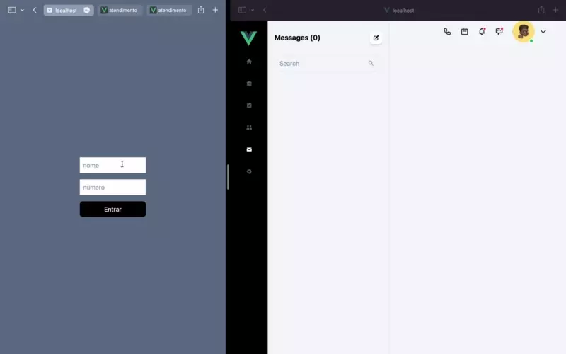
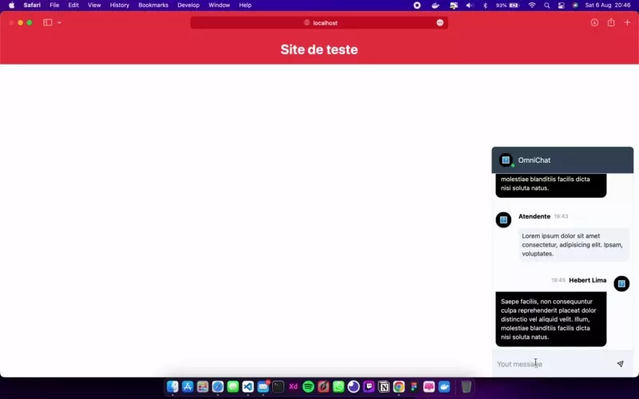

# OmniChat em Vue

### Chat Realtime


### Widget


### Discador Softphone (último recurso)


### Sobre o projeto

Esse projeto é um OmniChat; em outras palavras: um Hub de atendimento (objetivo centralizar canais de atendimento em um só lugar), esse pojeto esta sendo desenvolvido durante as lives que faço na [twitch](https://www.twitch.tv/limahebert) aos <b>Sábados 9 am</b>, com esse projeto busco explorar novas tecnologia e desafios como Socket.io, WebRTC, Softphone, arquitetura de software, aprender e ensinar entusiastas de desenvolvimento sobre essas tecnologias!

## Recursos
- Chat em tempo real
- Criação de Widget para ser inserido em qualquer site html e receber as msgs através do hub (Similar ao JivoChat)
- Integração com Webphone possibilitando realizar/receber ligações

## O que ja temos até agora?
 - [x] Interface do chat
 - [x] Interface do discador
 - [x] Simulação do discador de ligação
 - [x] Operaçoes básicas do chat
 - [x] Implementação do chat realtime (express + socket.io)
 - [ ] Criação de Widget (WIP)
## O que será feito?
 - [ ] Integração com WebPhone (fazer/receber ligaçoes no hub)

 ## Frameworks
 - Vue3
 - TailwindCss
 - NodeJs

## Sobre a Licença

Esse projeto é OpenSource, e você é autorizado a baixar, modificar e comercializar.

## Project setup
```
yarn install
```

### start vue
```
yarn dev
```

### start express
```
yarn api
```

### genmerate widget 
```
npx webpack -c webpack.config.js 
```