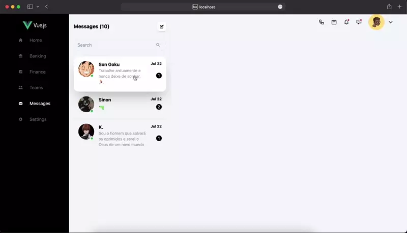

# atendimento

## Project setup
```
yarn install
```

### Compiles and hot-reloads for development
```
yarn serve
```

### Compiles and minifies for production
```
yarn build
```

### Lints and fixes files
```
yarn lint
```

### Sobre o projeto

Estou criando um painel de atendimento em VUE + Tailwind para explorar alguns recursos como WebPhone, socket.io entre outros, o desenvolvimento está sendo feito durante as lives no meu canal da [twitch](https://www.twitch.tv/limahebert) aos sábados após as <b>09:00 AM hrs</b>

## O que ja temos até agora?
 - [x] Interface do chat
 - [x] Interface do discador
 - [x] Simulação do discador de ligação
 - [x] Operaçoes básicas do chat (envio e recebimento de msgs)

## O que será feito?
 - [ ] Construção da Api com Express + Mongo DB
 - [ ] Implementação do chat realtime (socket.io)
 - [ ] Integração com alguma plataforma WebPhone

### Customize configuration
See [Configuration Reference](https://cli.vuejs.org/config/).


